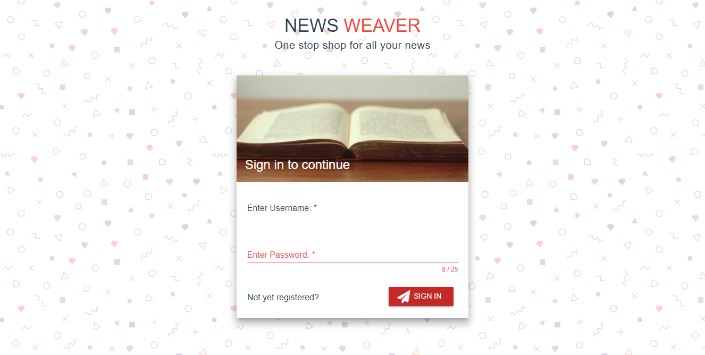

##   News-Weaver
> A simple web based RSS Aggregator
#### A work in progress
#### Inspired by: [https://github.com/GetStream/Winds](https://github.com/GetStream/Winds)
## NOTE: Due to restrictions imposed by [Heroku](https://www.heroku.com), the first time you login, it make take sometime as the server goes to sleep if not used for more than `30 mins` and thus needs to restart. This is something completely beyond my control.
#### Demo Link: [https://news-weaver.firebaseapp.com](https://news-weaver.firebaseapp.com)



## TODO:
* Add Badges For Unread News
* Add Categorization for Favourites

## Made With:
* [Express JS](https://expressjs.com)
* [Vue JS](https://vuejs.org)
* [VuetifyJS](https://www.vuetifyjs.com)
* [Moment JS](https://momentjs.com)
* [Axios JS](https://github.com/mzabriskie/axios)


## Getting Started:

### Pre-requisite:
MongoDB needs to be installed and running


##### Open a terminal:
```bash
    cd server
    npm install
    npm start
```
Serve with hot reload
``` npm run dev ```

##### Open another terminal:
Serve with hot reload
```bash
    cd client
    npm install
    npm run dev
```

## Restful API:
#### Endpoints:
```
    http://localhost:3000/auth/register
    POST
    username: Username,
    password: Password,
    rePassword: Password Again
```

```
    http://localhost:3000/auth/login
    POST
    username: Username,
    password: Password
```

```
    http://localhost:3000/user/get_feed?url=<url>&token=<AuthToken>
    GET
    url: URL of the feed
    AuthToken: Authorization token received after logging in
```

```
    http://localhost:3000/user/feed_news?index=<index>&hash=<hash>&token=<AuthToken>
    GET
    AuthToken: Authorization token received after logging in
    index: Returns the '15 * index + index' feeds
    hash: Hash of the feed source to get news from
```

```
    http://localhost:3000/user/feed_source?hash=<hash>&token=<AuthToken>
    GET
    AuthToken: Authorization token received after logging in
    hash: Hash about a feed source to get detailed info
```

```
    http://localhost:3000/user/save_feed?token=<AuthToken>
    POST
    AuthToken: Authorization token received after logging in
    title: Title of the feed source
    description: Description about the source
    favicon: Link to the site favicon
    feedURL: URL of the feed
    siteURL: URL of the website
```

```
    http://localhost:3000/user/delete_feed?token=<AuthToken>&hash=<hash>
    DELETE
    AuthToken: Authorization token received after logging in
    hash: Hash of the feed you want to delete
```

```
    http://localhost:3000/user/all_feed_sources?token=<AuthToken>
    GET
    AuthToken: Authorization token received after logging in
```

```
    http://localhost:3000/user/all_feed_news?token=<AuthToken>
    GET
    AuthToken: Authorization token received after logging in
```

```
    http://localhost:3000/user/favourites?token=<AuthToken>
    GET
    AuthToken: Authorization token received after logging in
```

```
    http://localhost:3000/user/save_favourite?token=<AuthToken>
    POST
    feedNews: {
        title: Title of the news,
        description: Description of the news,
        image: Image of the news,
        URL: URL of the news,
        summary: Summary of the news,
        category: List of categories,
        date: Date of news in ISO Format
    }
```

```
    http://localhost:3000/user/edit_favourite?token=<AuthToken>
    POST
    AuthToken: Authorization token received after logging in
    image: Image of the updated news
    title: Title of the updated news
    summary: Summary of the updated news
    hash: Hash of the news
```

```
    http:localhost:3000/user/delete_favourite?token=<AuthToken>
    DELETE
    AuthToken: Authorization token received after logging in
    hash: Hash of the favourite to delete
```

## Contributing:
> Feel free to create issues and pull requests for any features and errors.

## License:
### MIT License
